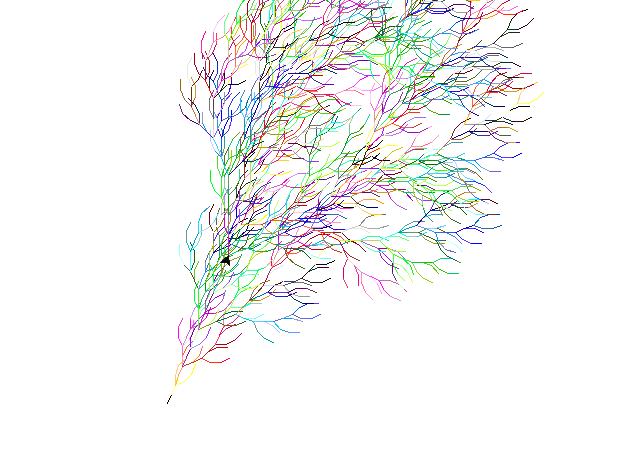

# L-system Simulator

Ce projet, réalisé en Python 3 en utilisant la bibliothèque Turtle, implémente un simulateur pour les L-systèmes, ou systèmes de Lindenmayer. Ces systèmes, utilisés en informatique théorique, modélisent le développement et la croissance de structures telles que les plantes et les bactéries.


## Prérequis

Assurez-vous d'avoir Python 3.x installé sur votre machine. Vous pouvez télécharger Python ici: [Python.org](https://www.python.org/downloads/).

## Installation

Clonez ce dépôt en local :

```bash
python3 -m venv .venv
source .venv/bin/activate
pip install -r requirements.txt
```

## Utilisation

Pour lancer le simulateur, utilisez l'une des commandes suivantes, en fonction du script désiré :

```bash
python3 main.py -i chemin/fichierDeSortie.txt -o chemin/fichierDeSortie.py

# ou

python3 colors_wtf.py chemin/fichierDeSortie.txt -o chemin/fichierDeSortie.py
```

Exemple :

```bash
python3 main.py example/context_allsides.txt -o example_l_system.py
```

Modifier la vitesse de la tortue graphique et l'exécution immédiate du tracé peut être réalisé en modifiant les paramètres `speed()` et `tracer()` dans le fichier `.py` généré.

tracer(0, 0) pour générer immédiatement le système.

## Exécution des résultats

Après la génération des fichiers Python dans le dossier `resultats`, exécutez les scripts comme suit :

```bash
python3 resultats/example_l_system.py
```

## Tests

Assurez-vous que le code fonctionne comme prévu en exécutant les tests unitaires :

```bash
python3 tests_unitaires.py
```

## Rendu Visuel




## Fonctionnalités

- Simulation de L-systèmes contextuels sur plusieurs cycles.
- Interprétation de commandes symboliques pour manipuler la tortue graphique :
  - **a**: baisser le crayon
  - **b**: relever le crayon
  - **+**: tourner vers la droite
  - **-**: tourner vers la gauche
  - **\***: faire demi-tour
  - **[**: début de branche
  - **]**: fin de branche
  - **l**: taille de crayon de 6
  - **m**: taille de crayon de 3
  - **s**: taille de crayon de 1
  - **r**: couleur rouge
  - **g**: couleur vert
  - **b**: couleur bleue
 
# Repos source
Base: https://github.com/gwendalauphan/L_systems_Turtle_Python.git
